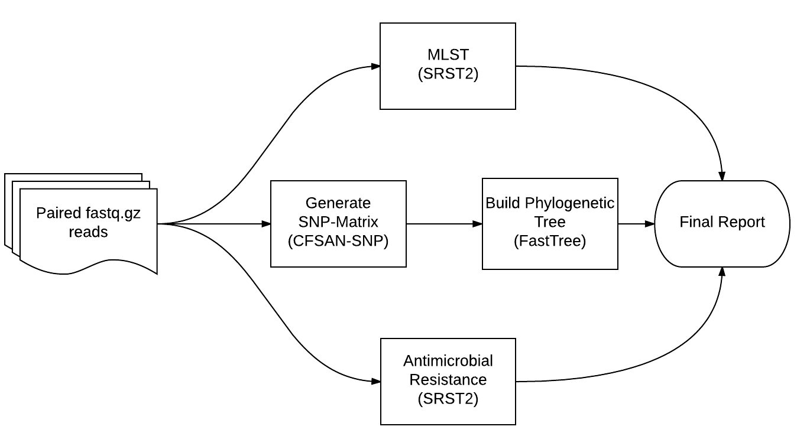

# DCLS GDIP

Pipeline to generate SNP matricies, phylogenetic trees, multilocus sequence typing (MLST) and antimicrobial micorbial resistance gene (AMR) reports from sequenced isolates involved in food-borne outbreak investigations.

# Quick Start

Assuming the [dcls/gdip/scripts](https://github.com/dcls/gdip/tree/master/scripts) directory is on your `$PATH`:

1. Enter a directory with some fastq files ending in `_1.fastq.gz` and `_2.fastq.gz`.
2. Copy the makefile using the command `copy_makefile`.
3. Run the pipeline with `make`.

```sh
# Enter the directory with the data:
cd exampledata

# Copy the makefile:
copy_makefile

# Start the pipeline!
make
```

For full instructions, see the [User Guide](userguide).

# Pipeline 



# Contact

- [Stephen D. Turner](http://www.google.com/recaptcha/mailhide/d?k=01lKgXnqE6Va_tcIEkUUMMXA==&c=8cNmVsuwaP7OG163K8z49WDuv5M9HBlzj1rfgVsTX_Y=)
- [Kevin G. Libuit](http://www.google.com/recaptcha/mailhide/d?k=01lKgXnqE6Va_tcIEkUUMMXA==&c=dCq1Is6PZSxjhRTptzOs-aBj0v9PvkiwAq3olZuP1Ek=)